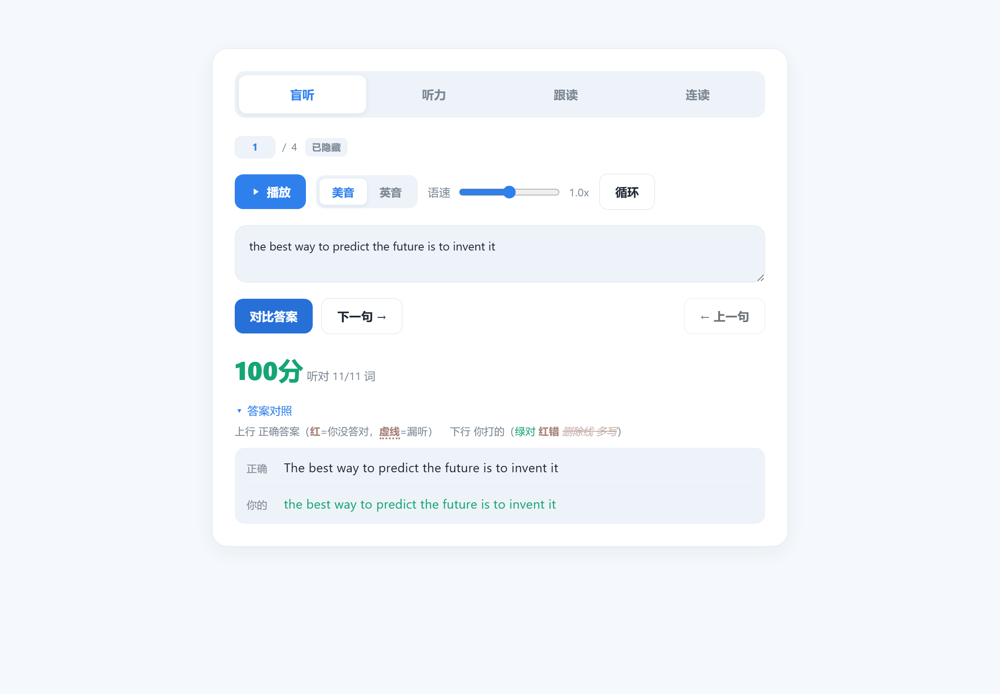
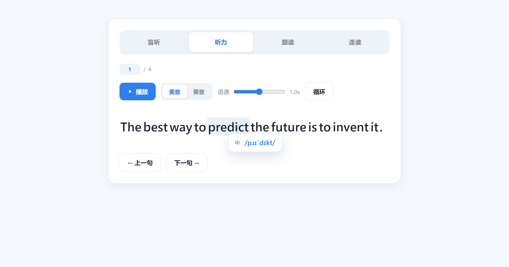
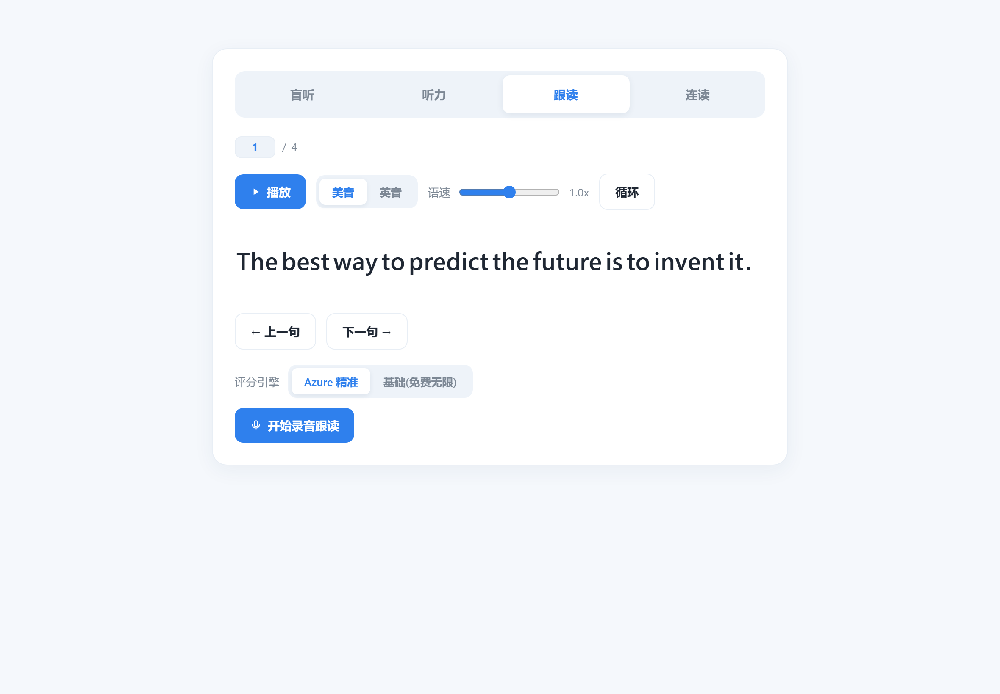
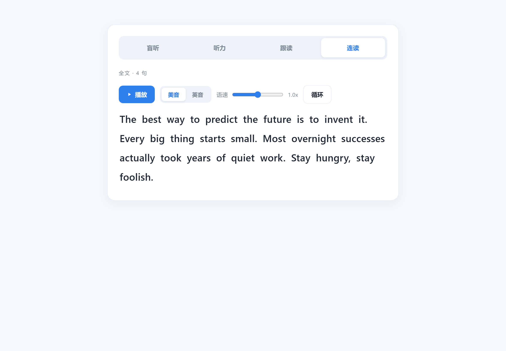
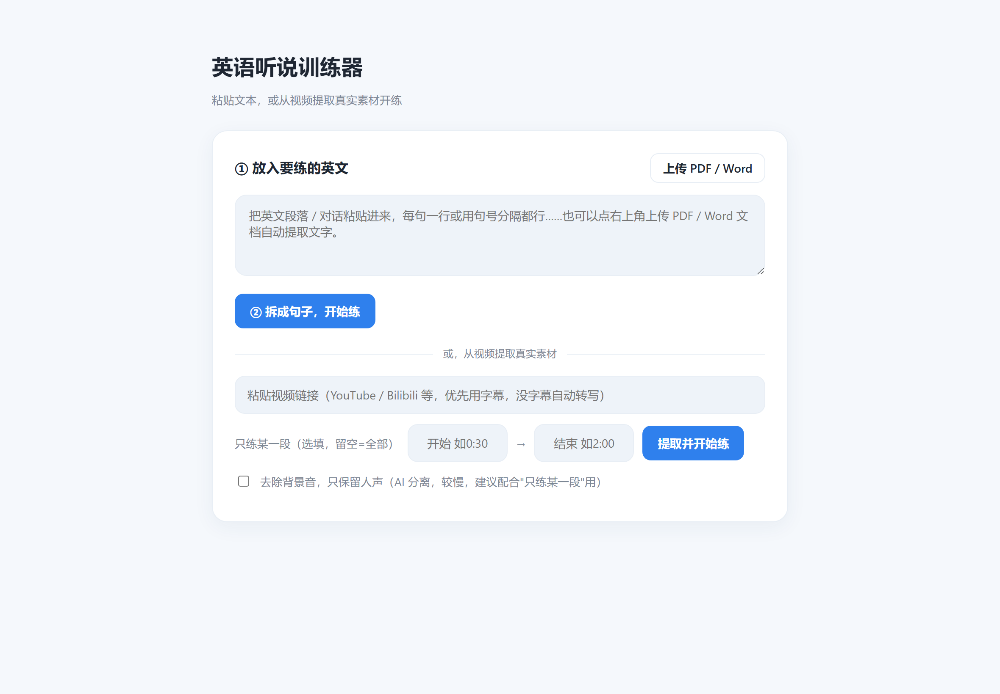

# English Listening & Speaking Trainer · 英语听说训练器

> Open-source, local alternative to Language Reactor + ELSA — turn **any** video into a listening, shadowing, and pronunciation workout. Free.
>
> 开源本地版的「Language Reactor + ELSA」——把**任意视频**变成听力 / 跟读 / 发音训练。免费、跑在你自己电脑上。

- **Any video in** — paste a YouTube / Bilibili / X link (or PDF/Word); uses subtitles, else local Whisper.
- **Dictate by typing** — type what you hear; auto word-splitting, word-level scoring. No more pause-and-scribble.
- **Shadow & score** — phoneme-level pronunciation feedback via Azure (free tier). Without a key you only get rough word-match (browser speech recognition, which relies on Google and may not work in mainland China).
- **Real audio + standard pronunciation** — original native voice; click any word for IPA + TTS.

[English](#english) · [中文](#中文) · [配置 B站 / Azure](docs/SETUP.md) · [给 AI agent 用 (AGENTS.md)](AGENTS.md) · License: MIT

> 想让 AI 帮你装好直接跑？把本仓库链接交给任意编码 agent（Codex / Claude Code / Cursor 等），说"按 AGENTS.md 配好并启动"即可。
> Hand this repo to any coding agent and say "set it up and run per AGENTS.md".

> **作者的话**：我自己用下来，是那种会上瘾的沉浸式听力训练——正反馈立竿见影。
> 再也不用在 B站 上点点停停、然后被推荐视频带跑；也不用在纸上写了改、改了写。
> 配合影子跟读 + 盲听的练法（尚雯婕等自学者公开分享过的路子），谁用谁知道。
>
> **A note from me**: For me it became the addictive, immersive kind of listening practice — the
> positive feedback is immediate. No more pause-stop-pause on a video and getting dragged off by
> recommendations; no more scribbling on paper and crossing it out. Paired with shadow-reading +
> blind dictation, you'll get it once you try it.



<table>
<tr>
<td width="50%"></td>
<td width="50%"></td>
</tr>
<tr>
<td width="50%"></td>
<td width="50%"></td>
</tr>
</table>

---

<a name="english"></a>

## English

### Why this exists

Most listening apps stop once you can *understand* and *repeat*. The gap between "I get it" and "I can produce it" is the hardest part — and the least served. This tool chains the full path on top of **authentic material you choose**:

**Decode the sounds → articulate them → (planned) use them.**

What makes it different:

- **Bring your own material** — paste any video link (YouTube / Bilibili / X / anything yt-dlp supports) or upload a PDF/Word. Subtitles are used when available; otherwise it transcribes locally with Whisper.
- **Type-while-you-listen dictation** — no more pausing/rewinding and scribbling on paper. Type what you hear; it auto-segments words (you don't even need to type spaces) and scores you word by word.
- **Real audio, standard pronunciation on demand** — video sentences play the original native voice (connected speech, reductions, real accents); click any word to hear the Edge TTS standard pronunciation (US/UK switchable) and see its IPA.
- **Phoneme-level pronunciation scoring** — shadow a sentence, and Azure pronunciation assessment scores accuracy / fluency / completeness / prosody, down to individual phonemes. Falls back to free browser recognition when no Azure key is set.

### Modes

| Mode | What you do |
|---|---|
| Blind listening | Hear it, type what you caught. Auto word-segmentation + word-level diff (right / misheard / missed). Enter to compare, Enter again for next. |
| Listening | Click words for IPA + standard pronunciation. |
| Shadowing | Record yourself; get phoneme-level scoring (Azure) or free browser matching. Space to start/stop, Enter for next. |
| Connected reading | Whole passage with per-word highlight for shadow reading. |

Plus: history with resume, time-range extraction for long videos, optional background-music removal (Demucs).

### Quick start

**Prerequisites**
- Python 3.10 or 3.11
- ffmpeg on your PATH (Windows: `winget install Gyan.FFmpeg` · macOS: `brew install ffmpeg`)

**Install & run**
```bash
git clone https://github.com/Oliviaviaviavia/english-trainer.git
cd english-trainer
python -m venv .venv
# Windows: .venv\Scripts\activate   |   macOS/Linux: source .venv/bin/activate
pip install -r requirements.txt
python -m uvicorn app:app --port 8000
```
Open **http://localhost:8000** (use `localhost`, not the LAN IP, so the browser grants microphone access).

**Three of the four modes need zero setup** — blind-listening, listening, and connected-reading work right away once you paste any English text or a YouTube link. The **shadowing** mode needs an Azure key for real pronunciation scoring (free tier); without it you only get rough browser word-matching, which also depends on Google and may not work in mainland China. (Bilibili videos additionally need a login cookie — see below.)

### Configuration (all optional, bring your own)

This repo ships **no credentials**. Add your own only for the features you want.
**→ Step-by-step guide with screenshots: [docs/SETUP.md](docs/SETUP.md)** (covers both, in Chinese).

- **Bilibili videos** — B站 returns HTTP 412 for logged-out requests. Install the browser extension "Get cookies.txt LOCALLY", log in to Bilibili, export `cookies.txt`, and drop it in the project root (auto-detected, no restart). Other sites usually need no cookies.
- **Pronunciation scoring (needed for the shadowing mode)** — create an Azure Speech resource (Free F0, 5 hours/month, no charge). Put the key in `azure_key.txt` (line 1 = key, line 2 = region like `southeastasia`), or set `AZURE_SPEECH_KEY` / `AZURE_SPEECH_REGION`. Without it, shadowing falls back to browser speech recognition that only checks whether you said the right words (not real pronunciation scoring) — and that fallback relies on Google, so it often won't work in mainland China.
- **Background-music removal (optional)** — needs torch + Demucs:
  ```bash
  pip install torch==2.2.2 torchaudio==2.2.2 --index-url https://download.pytorch.org/whl/cpu
  pip install demucs==4.0.1
  ```

`cookies.txt` and `azure_key.txt` are git-ignored and must never be committed or shared — they contain your login session / key.

### Compatibility notes

A few versions in `requirements.txt` are pinned on purpose because newer ones crashed on the author's machine (AMD Ryzen 6000-series CPU):
- `ctranslate2==4.4.0` — newer versions segfault when loading the Whisper model.
- `numpy==1.26.4` (<2) — otherwise "Failed to initialize NumPy".
- Optional `torch==2.2.2` (CPU) — newer torch fails to import (c10.dll init).

On newer hardware you can try relaxing these; fall back to the pinned versions if you hit those crashes.

### Disclaimer

A personal English-learning tool, for study and research only. You are responsible for complying with the terms of service and copyright of the video platforms you use. Not for copyright infringement or commercial use. Video extraction is built on the open-source project [yt-dlp](https://github.com/yt-dlp/yt-dlp).

---

<a name="中文"></a>

## 中文

### 它解决什么

大多数听力软件练到"听得懂、能复读"就停了。可"听得懂"到"自己能用出来"中间隔着最难、也最少人做的一段。这个工具在**你自己选的真实素材**上把整条路串起来：

**听懂声音 → 发得出来 → （规划中）用得出来。**

练习路径借鉴**影子跟读 + 盲听**——尚雯婕等自学者公开分享过的路子。

差异点：

- **素材你自己带**——粘贴任意视频链接（YouTube / Bilibili / X / 凡是 yt-dlp 支持的站），或上传 PDF/Word。有字幕优先用字幕，没字幕本地 Whisper 转写。
- **边听边打字听写**——不用反复点暂停/倒带再在纸上写。打出你听到的，程序自动分词（连着打、不打空格都行）、逐词给你判对错。
- **真人原声 + 随手听标准音**——视频句子放原声（连读、弱读、真实口音都在）；点任意单词，用 Edge TTS 念出标准音（美音/英音可切）并显示音标。
- **音素级发音评分**——跟读一句，Azure 发音评测给出 准确度/流利度/完整度/韵律，细到每个音素。没配 Azure key 时自动退回免费的浏览器识别。

### 四种模式

| 模式 | 你做什么 |
|---|---|
| 盲听 | 只听不看，打出听到的。自动分词 + 逐词标对错（对/听错/漏听）。Enter 对比，再 Enter 下一句。 |
| 听力 | 点单词看音标、听标准发音。 |
| 跟读 | 录音，拿音素级评分（Azure）或免费浏览器匹配。空格起停录音，Enter 下一句。 |
| 连读 | 整篇逐词高亮，做影子跟读。 |

另有：历史记录续练、长视频按时间段提取、可选去除背景音乐（Demucs）。

### 快速开始

**前置**：Python 3.10 / 3.11，且 ffmpeg 在 PATH 里。

```bash
git clone https://github.com/Oliviaviaviavia/english-trainer.git
cd english-trainer
python -m venv .venv
# Windows: .venv\Scripts\activate   |   macOS/Linux: source .venv/bin/activate
pip install -r requirements.txt
python -m uvicorn app:app --port 8000
```
浏览器打开 **http://localhost:8000**（用 `localhost` 访问，否则不给麦克风权限）。

**四个模式里三个零配置**——盲听 / 听力 / 连读，粘段英文或贴个 YouTube 链接就能直接用。**跟读**模式要真正的发音纠正需要 Azure key（有免费额度）；不配只能用浏览器识别做粗略的"说没说对词"匹配（非真实纠音），而且它依赖 Google、**国内常常用不了**。（练 B站 视频另外要登录 cookie，见下。）

### 配置（都可选，各填各的）

本仓库**不含任何密钥**，需要哪个功能就填自己的。
**→ 带图详细步骤看这里：[docs/SETUP.md](docs/SETUP.md)**（B站 与 Azure 都有，手把手）。

- **B站视频**：未登录会 412。用浏览器扩展 "Get cookies.txt LOCALLY" 登录 B站、导出 `cookies.txt` 放项目根（自动识别、不用重启）。其他站点一般不用 cookie。
- **发音评分（跟读模式需要）**：注册 Azure Speech 资源（Free F0，每月 5 小时免费不扣费）。把 key 写进 `azure_key.txt`（第1行 key，第2行区域如 `southeastasia`），或设环境变量 `AZURE_SPEECH_KEY` / `AZURE_SPEECH_REGION`。不配则只能用浏览器识别做"说没说对词"的文字匹配（非真实发音评分），且该兜底依赖 Google、国内常常用不了。
- **去背景音（可选）**：需装 CPU 版 torch + Demucs（见上方英文 install 命令）。

`cookies.txt` / `azure_key.txt` 已被 git 忽略，**切勿提交或外发**，里面是你的登录态/密钥。

### 兼容性踩坑

`requirements.txt` 里几个版本是特意锁的，因为新版在作者机器（AMD Ryzen 6000 系）上会崩：`ctranslate2==4.4.0`（新版加载模型段错误）、`numpy==1.26.4`（否则 NumPy 初始化失败）、可选 `torch==2.2.2` CPU 版（新版导入即崩）。硬件较新可自行放开，崩了就退回这些版本。

### 免责声明

个人英语学习工具，仅供学习研究。使用者需自行遵守视频平台条款与版权规定，勿用于侵权或商业用途。视频提取基于开源项目 [yt-dlp](https://github.com/yt-dlp/yt-dlp)。

---

## License

[MIT](./LICENSE) © Oliviaviaviavia

If this helps you, a star is appreciated. 觉得有用的话，点个 star。
